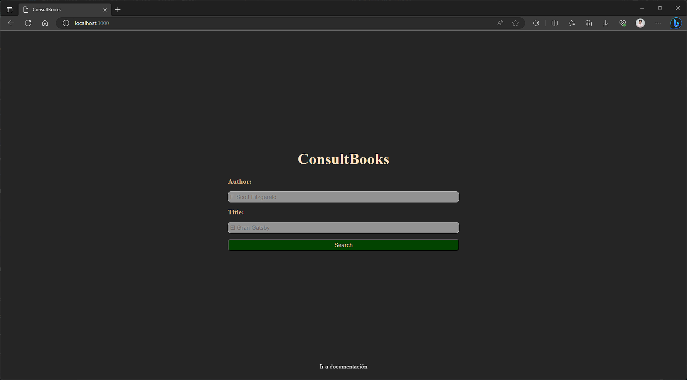

1. Clonar repositorio de GitHub:

```
git clone https://github.com/rbarrientosg/consult_books.git
```

2. Instalar dependencias de Node.js:

```
npm install
```

3. Añadir script para ejecutar proyecto en el package.json (`Ya configurado en este proyecto`):

```
{
  "scripts": {
    "start": "nodemon ./src/app.js",
  }
}
```

4. Ejecuta proyecto:

```
npm run start
```

5. Para asegurarte que se ha ejecutado correctamente deberas de ver la siguiente salida en terminal:

```
~/test_JSDoc
- npm run start          

> test_jsdoc@1.0.0 start
> nodemon ./src/app.js

[nodemon] 3.0.1
[nodemon] to restart at any time, enter `rs`
[nodemon] watching path(s): *.*
[nodemon] watching extensions: js,mjs,cjs,json
[nodemon] starting `node ./src/app.js app.js`
Server is listening in PORT: 3000
```

6. Dirigete a tu navegador introduce la siguiente url; http://localhost:3000/.  
Felicidades, ahora estas en el layout principal del proyecto.

