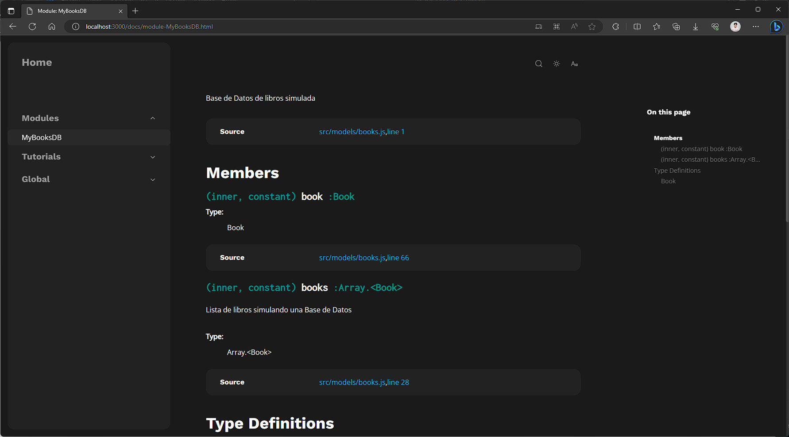

1. Instalar JSDoc en tu proyecto Node.js (`Para este proyecto ya se instala al hacer 'npm install'`):

```
npm install jsdoc
```

2. Instalar JSDoc Templete (`Para este proyecto ya se instala al hacer 'npm install'`):

```
 npm install clean-jsdoc-theme
```

3. Crear archivo de configuración para JSDoc (`Ya creado para este proyecto`):

```
touch jsdoc.json
```

4. Configurar JSDoc (`Ya configurado para este proyecto`):
 
```
{
  "plugins": ["plugins/markdown"],
  "markdown": {
    "hardwrap": false,
    "idInHeadings": true
  },
  "source": {
    "include": ["app.js", "src"],
    "includePattern": ".js$",
    "excludePattern": "(node_modules|src/public/docs|src/public/css|src/views)"
  },
  "templates": {
    "cleverLinks": false,
    "monospaceLinks": false
  },
  "opts": {
    "recurse": true,
    "destination": "./src/public/docs",
    "tutorials": "./src/public/tutorials",
    "template": "./node_modules/clean-jsdoc-theme",
    "theme_opts": {
        "default_theme": "dark"
    }
  }
}
```

5. Agregar script para ejecutar JSDoc en el archivo package.json (`Ya agregado para este proyecto`):

```
{
  "scripts": {
    "docs": "jsdoc -c jsdoc.json",
  },
}
```

6. Una vez se requiera generar documentación,
se deberá ejecutar el script desde la terminal:

```
npm run docs
```

7. La documentación correspondiente podra ser encontrada en la carpeta './src/public/docs' a partir de la carpeta raiz del proyecto.

8. Por ultimo solo debera ejecutar el archivo 'index.html' ubicado en la carpeta `docs` para poder ver la documentación en su navegador preferido.

