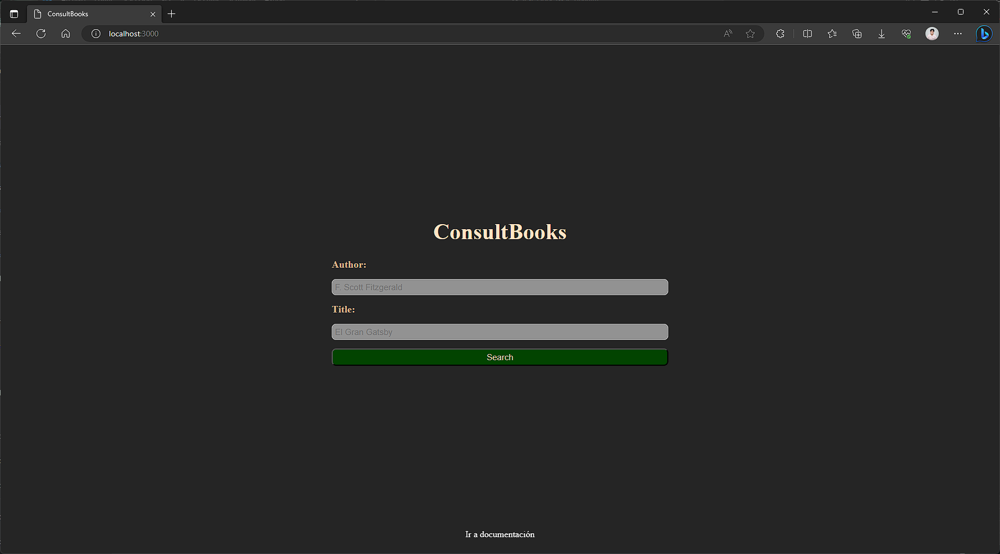
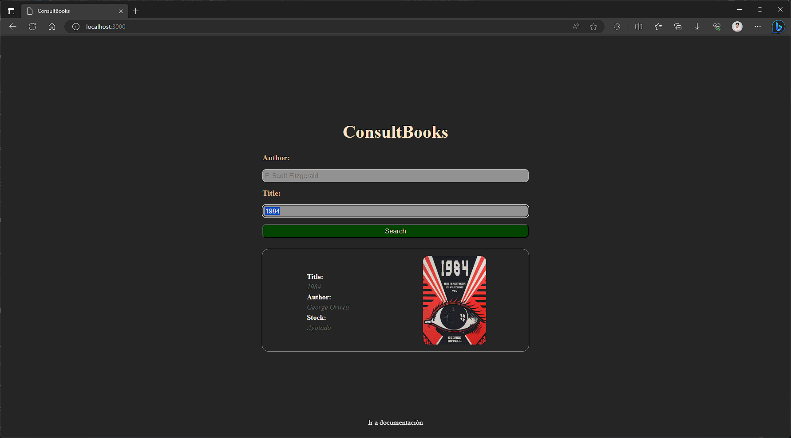
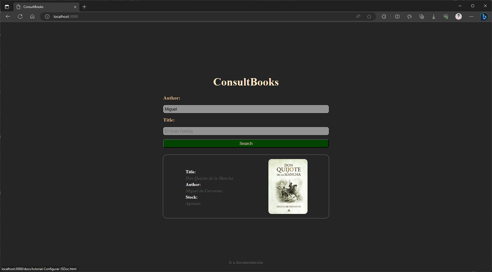
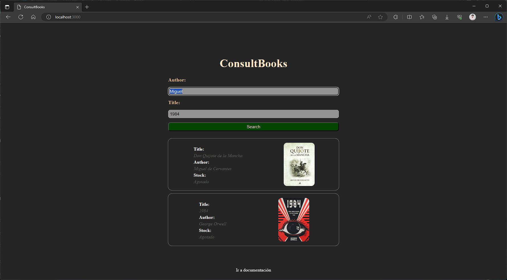

1. Acceda a la pagina Web de ConsultBooks.

2. Puede consultar por `titulo` de libro agregando este en el `input correspondiente y clickeando en el boton Search`.

3. Puede consultar por `autor` de libro agregando este en el `input correspondiente y clickeando en el boton Search`.

4. Puede consultar por `titulo y autor` de libro agregando la información en los `inputs correspondientes y clickeando en el boton Search`.

5. Disfrute de este nuevo servicio en BooksStore.